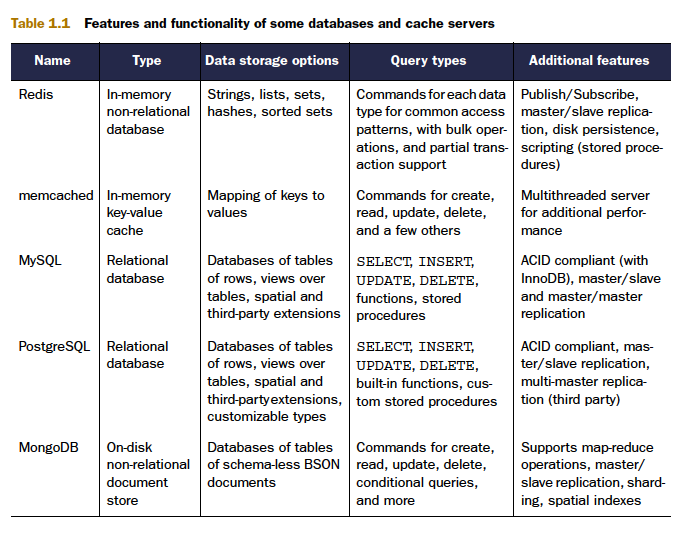
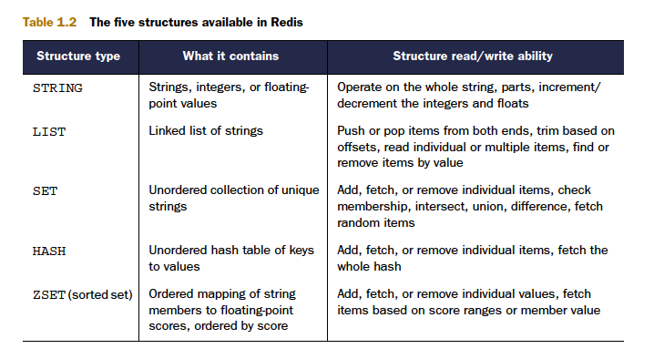

# redis
My doc for redis

## 1.1 What is Redis?
When I say that Redis is a database, I’m only telling a partial truth. Redis is a very fast
non-relational database that stores a mapping of keys to five different types of values.
Redis supports in-memory persistent storage on disk, replication to scale read performance,
and client-side sharding1 to scale write performance. That was a mouthful, but
I’ll break it down by parts.

### 1.1.1 Redis compared to other databases and software
Redis is a type of database that’s commonly referred to as NoSQL or non-relational. In Redis, there are no tables, and there’s no databasedefined or -enforced way of relating data in Redis with other data in Redis.
Redis supports the writing of its data to disk automatically in two different ways, and can store data in four structures in addition to plain string keys

Generally speaking, many Redis users will choose to store data in
Redis only when the performance or functionality of Redis is necessary, using other
relational or non-relational data storage for data where slower performance is acceptable,
or where data is too large to fit in memory economically. In practice, you’ll use
your judgment as to where you want your data to be stored (primarily in Redis, or primarily
somewhere else with a copy in Redis), how to ensure data integrity (replication,
durability, and transactions), and whether Redis will fit your needs.

### 1.1.2 Other features

Redis has two different forms of **persistence** available for writing in-memory data to disk in a compact format. The first method is a point-in-time dump either when certain conditions are met (a number of
writes in a given period) or when one of the two dump-to-disk commands is called.

Even though Redis is able to perform well, due to its in-memory design there are
situations where you may need Redis to process **more read queries than a single Redis server can handle**. To support higher rates of read performance (along with handling
failover if the server that Redis is running on crashes), Redis supports **master/slave**
replication where slaves connect to the master and receive an initial copy of the full
database. As writes are performed on the master, they’re sent to all connected slaves
for updating the slave datasets in real time. With continuously updated data on the
slaves, clients can then connect to any slave for reads instead of making requests to the
master.

### 1.1.3 Why Redis?
By using Redis instead of a relational or other primarily on-disk database, you can
avoid writing unnecessary temporary data, avoid needing to scan over and delete this
temporary data, and ultimately improve performance. data is always in memory,and queries to Redis
don’t need to go through a typical query parser/optimizer. These are both simple examples,
but they demonstrate how your choice of tool can greatly affect the way you solve
your problems.

As you continue to read about Redis, try to remember that almost everything that we
do is an attempt to solve a problem in real time

## 1.2 Data Structure

